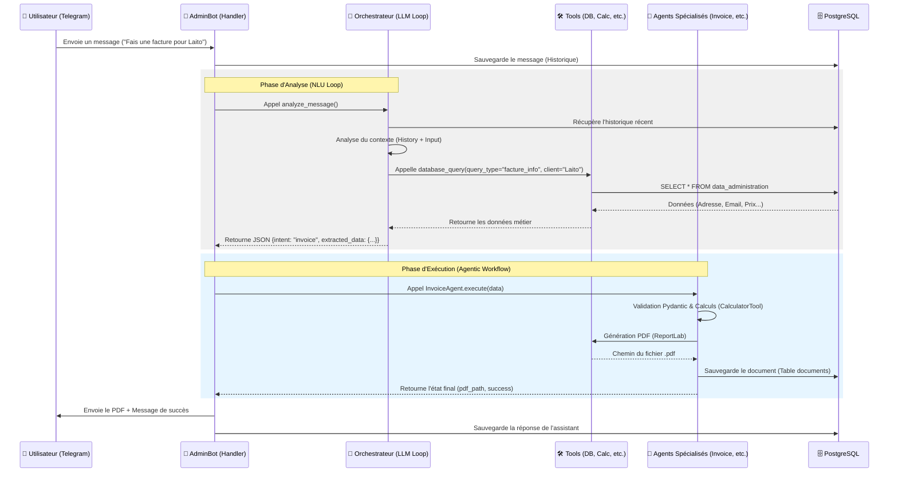

# Schéma Fonctionnel des Échanges - Admin Agent Pro

Ce document détaille le flux des messages et la logique d'interaction entre l'utilisateur, l'orchestrateur, les outils et les agents spécialisés.

## 📊 Flux Séquentiel des Échanges

---

## 🧱 Architecture en 3 Couches

### 1. Couche d'Interface (Telegram & Bot)
*   **Composant** : `execution/telegram_bot.py`
*   **Rôle** : Point d'entrée unique. Gère la connexion avec l'API Telegram, valide l'accès des administrateurs, et route les messages vers l'orchestrateur ou les commandes directes.
*   **Persistance** : Chaque interaction est logguée dans la table `chat_history`.

### 2. Couche d'Intelligence (Orchestrateur)
*   **Composant** : `execution/agents/orchestrator_agent.py`
*   **Rôle** : Analyse d'intention (NLU) et extraction d'entités.
*   **Logique de Raisonnement** : Utilise une boucle de réflexion (Reasoning Loop) lui permettant d'appeler des outils (`Tools`) pour enrichir son contexte (ex: chercher l'adresse d'un client en base) avant de formuler une réponse finale.
*   **Gestion des Confirmations** : Capable d'interpréter des messages courts comme "Vas-y" ou "Ok" en se basant sur l'historique de la conversation.

### 3. Couche d'Exécution (Outils & Agents Spécialisés)
*   **Composants** : `execution/agents/*.py` & `execution/tools/*.py`
*   **Rôle** : Réalisation déterministe des tâches administratives.
    *   **Agents** : Portent la logique métier spécifique à chaque document (Facture, Devis, KM, etc.).
    *   **Tools** : Fournissent des fonctionnalités atomiques et réutilisables (Calcul précis `Decimal`, Requêtes SQL, Génération PDF, Envoi Email).

## 🗄️ Modèle de Données (PostgreSQL)

1.  **`data_administration`** : Source de vérité pour les données métier (Clients, Tarifs, Coordonnées).
2.  **`documents`** : Registre légal des documents générés (numéros de facture, chemins PDF).
3.  **`chat_history`** : Mémoire contextuelle pour l'IA.
4.  **`kilometres_parcourus`** : Suivi kilométrique cumulé.
